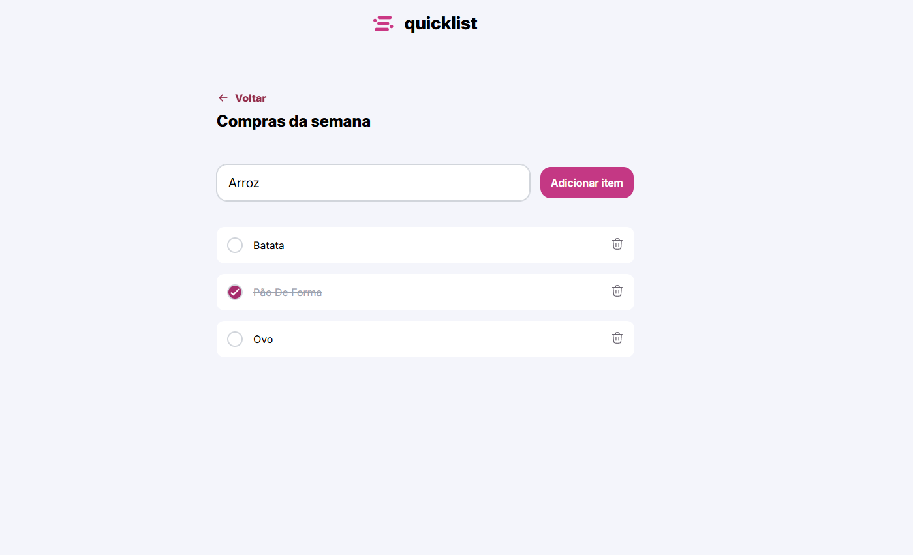

<h1 align="center" style="font-weight: bold;">Convert Money💻</h1>

 <a href="#tech">Technologies</a> • 
 <a href="#started">Getting Started</a> • 

    <b>
      Shopping list in CRUD, where I trained in JavaScript, creating, reading, removing, updating, and saving tasks in local storage.
    </b>

     <a href="https://thalesfortes.github.io/ConvertMoney/">📱 Visit this Project</a>

<h2 id="layout">🎨 Layout</h2>

      

<h2 id="tech">💻 Technologies</h2>

- HTML5
- CSS3
- JAVASCRIPT

<h2 id="started">🚀 Getting started</h2>

- Just download the project with its assets and run it with liveserve or just by opening the html document

